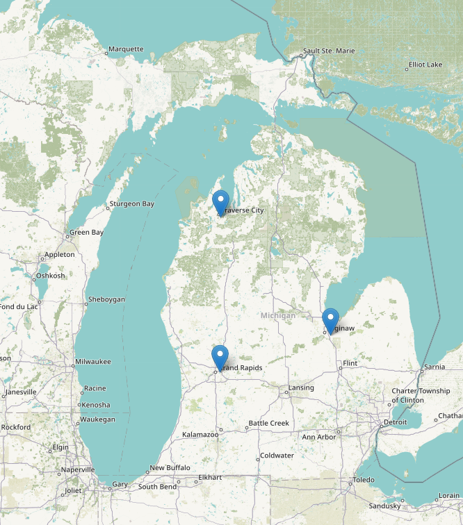

<h1 align="center">Routy Frontend</h1> 

*
 The Routy Application 
*

Welcome to the Routy Application. This application is meant to be safe place for users to save locations on the map in different categories (places to go, activity, danger,..) and come back to them later on. 

---
### Table of Content

- [Description](#description)
- [Specification](#specification)
  - [Backend](#backend)
    - [Versioning](#versioning)
    - [Database](#database)
  - [Front-end](#front-end)
- [Installation](#installation)
- [Challanges](#challanges)
- [Future upgrades](#future-upgrades)
- [Bugs](#bugs)
- [Contributions](#contributions)
    - [Code of Conduct](#code-of-conduct)
- [License](#license)

---

## Description
Users for this application will first have two choices either to sign up and create a new account or if they already have one they can log in.
After signing in users will have their markers displayed on the left side with a map on the right. Each marker can be deleted or loaded to the map. By clicking on the specific marker (outside the delete and load buttons) map will be centered with a marker in its center.
Map event will give the user the option to click anywhere on the map which will display the form for creating a new marker. Loaded markers can be removed from the map by double clicking on them.

Displaying any form will give us the option to 'cancel' what we are doing and return to the previous state. 
Every action on this application will be followed with messages that will be displayed in the top part of the application under the application name (messages will disappear after 3 seconds). Any wrongdoing (sign up with an email that is already in use, wrong password,..) will trigger a browser alert and reset UI. 

Enyoy!   
___

## Specification
### Backend
The server side of this application if build with ***Ruby on Rails* and **Postgresql** as database.

#### Versioning
- Language: `ruby 3.0.0p0`
- Framework: `Rails 7.0.3` 

#### Database
Database used for this application is `postgreSQL`.

For more information please see backend `readme.md` [here](https://github.com/zicna/routy-backend#readme).

### Front-end
The frontend is written in vanilla JavaScript, utilizing JS6 syntax and in an OOP manner utilizing `export` and `import` classes and functions from a JS module. 
Architecture for the frontend part of the application is following the `MVC` paradigm of application logic division. 
___

## Installation
   1. Backend instructions can be found [here](https://github.com/zicna/routy-backend#readme "readme.md for backend part of application").
   2. Frontend [(github link)](https://github.com/zicna/routy-frontend "github link for frontend")

  - fork this repo
  - clone it to your local environment
  - in root terminal run `open index.html`
___   

## Challanges
 - using JS modules 
 - implementing MVC application architecture 
 - using external libraries (leaflet map) and working with them
___
## Future upgrades
- [ ] Loading spinner to give better user experience while waiting for web API to be loaded
- [ ] Better styling options
- [ ] Better error handling through out various situations
___
## Bugs
1. Certain problem can occur while leaflet map is loading since it is happening asynchronously  

For any questions or bugs reports please conntact me [here](http://www.milan-zivkovic.com). Thank you!

___
## Contributions

Pull requests are more then welcome [here](https://github.com/zicna/routy-backend) for backend and [here](https://github.com/zicna/routy-frontend) for frontend. This project is intended to be a safe, welcoming space for collaboration, and contributors. Thank you!!! 🙏🙏🙏

#### Code of Conduct

Our Pledge

In the interest of fostering an open and welcoming environment, we as contributors and maintainers pledge to making participation in our project and our community a harassment-free experience for everyone, regardless of age, body size, disability, ethnicity, gender identity and expression, level of experience, nationality, personal appearance, race, religion, or sexual identity and orientation.

Our Standards
Examples of behavior that contributes to creating a positive environment include:

Using welcoming and inclusive language
Being respectful of differing viewpoints and experiences
Gracefully accepting constructive criticism
Focusing on what is best for the community
Showing empathy towards other community members
Examples of unacceptable behavior by participants include:

The use of sexualized language or imagery and unwelcome sexual attention or advances
Trolling, insulting/derogatory comments, and personal or political attacks
Public or private harassment
Publishing others' private information, such as a physical or electronic address, without explicit permission
Other conduct which could reasonably be considered inappropriate in a professional setting
Our Responsibilities
Project maintainers are responsible for clarifying the standards of acceptable behavior and are expected to take appropriate and fair corrective action in response to any instances of unacceptable behavior.

Project maintainers have the right and responsibility to remove, edit, or reject comments, commits, code, wiki edits, issues, and other contributions that are not aligned to this Code of Conduct, or to ban temporarily or permanently any contributor for other behaviors that they deem inappropriate, threatening, offensive, or harmful.

**Scope**

This Code of Conduct applies both within project spaces and in public spaces when an individual is representing the project or its community. Examples of representing a project or community include using an official project e-mail address, posting via an official social media account, or acting as an appointed representative at an online or offline event. Representation of a project may be further defined and clarified by project maintainers.

**Enforcement**

Instances of abusive, harassing, or otherwise unacceptable behavior may be reported by contacting the project team at <a href="mailto:zivkovicmilan1987@gmail.com">email</a>. All complaints will be reviewed and investigated and will result in a response that is deemed necessary and appropriate to the circumstances. The project team is obligated to maintain confidentiality with regard to the reporter of an incident. Further details of specific enforcement policies may be posted separately.

Project maintainers who do not follow or enforce the Code of Conduct in good faith may face temporary or permanent repercussions as determined by other members of the project's leadership.

___

##   License
This application is avaiable as open source under the terms of the [MIT License](license).

<!-- * inline colored elements: -->

<!-- <spam style="color:yellow">yellow</spam>
<spam style="color:red">red</spam>
<spam style="color:green">green</spam>
<spam style="color:blue">blue</spam>
<spam style="color:pink">pink</spam>
<spam style="color:orange">orange</spam> -->

<!-- * Emoji often used in readme.md -->

<!-- 
✅✅✅✅

❌❌❌❌

find more [here](https://emojidb.org/beer-emojis) -->

